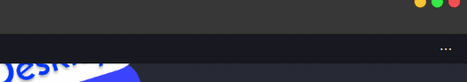
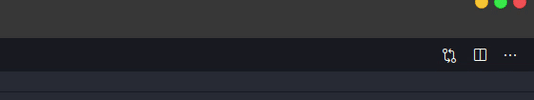

<h1 align="center">
      
</h1>

<h3 align="center">
  Deskify
</h3>

<p align="center">Desktop notification with multiple features 📖</p>
<p align="center">Made with Golang🚀</p>

<p align="center">
  

  

  

  <a href="https://github.com/Lgdev07/deskify/stargazers">
    
  </a>
</p>

<p align="center">
  <a href="#-installation-and-execution">Installation and execution</a>&nbsp;&nbsp;&nbsp;|&nbsp;&nbsp;&nbsp;
  <a href="#-how-to-contribute">How to contribute</a>&nbsp;&nbsp;&nbsp;
</p>

## 🎉 Presentation

<h1 align="left">
  
</h1>

<h1 align="left">
  
</h1>

## 💫 Features

- [x] [Pomodoro Timer](#pomodoro_timer)
- [x] [Tasks Reminder](#tasks_reminder)
- [x] [Twitch Channel Notification](#twitch)

## 🚀 Installation and execution

Deskify is available for macOS, Windows, and Linux.

1. Download the binary avaliable on [releases](https://github.com/Lgdev07/promotions/releases);
2. Run `deskify`;

```sh
# Run `--help` for detailed information about CLI commands
deskify [command] help
```

## 🤔 How to contribute

- Fork this repository;
- Create a branch with your feature: `git checkout -b my-feature`;
- Commit your changes: `git commit -m 'feat: My new feature'`;
- Push to your branch: `git push origin my-feature`.

After the merge of your pull request is done, you can delete your branch.

---